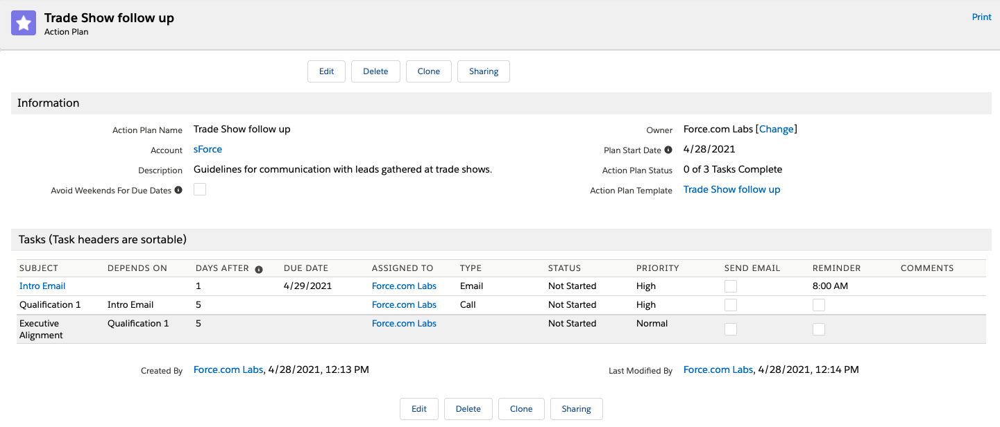
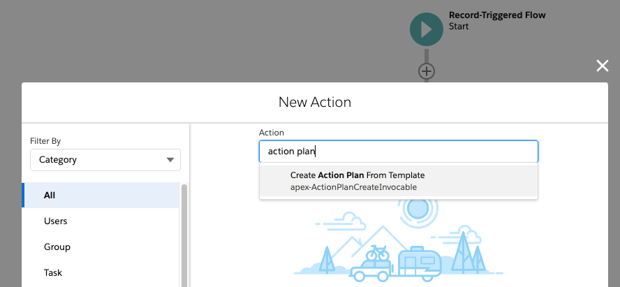

# Action Plans

## Badges
[](https://opensource.org/licenses/BSD-3-Clause)
[](https://codecov.io/gh/dschach/ActionPlans)
[](https://twitter.com/salesforce_labs)

# Action Plans Installation and Setup

Please follow installation instructions, shown on the [Installation page](/INSTALLATION.md)

<!-- ActionPlans is also listed on the AppExchange. -->

# About Action Plans

Action Plans helps your organization encapsulate best practices into easily sharable, reusable task templates.

You can create Action Plans for the following objects:

-   Accounts
-   Contacts
-   Leads
-   Opportunities
-   Campaigns
-   Contracts
-   Cases
-   Person Accounts
-   Custom Objects

## Getting Help

Action Plans is unsupported. For community assistance with Action Plans, please visit [Salesforce Trailblazer Community](https://trailblazers.salesforce.com/). To submit ideas or issues, please visit [Action Plans on Github](https://github.com/SalesforceLabs/ActionPlans).

## Community

Action Plans is open source software. We welcome your issue reports, ideas, documentation, code tweaks and all other participation. [Learn more](http://blogs.developerforce.com/labs/2011/08/howto-contribute-to-milestones-pm-code-not-required-opensource.html).

### Features:

-   Export and share your Action Plan Templates with other orgs.
-   Import Action Plan Templates.
-   Supports Task reminder times.
-   Action Plans Settings controls behavior around Chatter Notifications, actions when a Lead is converted, and default Task assignment behavior
-   Invocable Apex allows automatic Action Plan creation from a Template in Process Builder and Flow

# Post Install Configuration

Getting started is easy. For each object, you need to add a button to the list view, add a button to the detail page. For Accounts, follow these steps:"

## Update Action Plans Custom Settings

 Change these setting by editing Action Plan Settings, and updating values at either the organization level, profile levels, or user levels.

Navigate to Setup > Develop > Custom Settings. Click on 'Manage' next to `Action Plans Settings`. Click the 'New' button near 'Default Organizational Level Value'. Check the values that you want to enable.
- `Enable Chatter Post` places a post in the related record's Chatter Feed (if Chatter is enabled for that object). If unchecked, Action Plans does not create a Feed Post.;
- `Unassigned Task Defaults to Record Owner` ensures that Action Plan Template tasks with a blank 'Assigned To' field go to the related record's owner. If unchecked, tasks with a blank 'Assigned To' field are assigned to the running user. Tasks can be assigned to specific people on Action Plan Templates, which overrides this setting.
- `Default Object on Lead Conversion` specifies that if an Action Plan is related to a Lead, whether the Action Plan should be moved to the converted Account, Contact, or Opportunity when the Lead is converted. The default is Contact.
- `Action Plans Business Hours ID` and `Use Business Hours` are reserved for future functionality.

## Task Record Types

If your org uses Task Record Types, you must specify which Record Type to use for all Tasks on each Action Plan Template record. This will affect the Status values available for each related Action Plan Task. This cannot be changed once an Action Plan or Template is created.

## Weekends: Custom Metadata

Modify Custom Metadata `Weekend Day` to indicate which days of the week are the weekend and how many days to move a task forward or backwards to move it to the end of the previous week or the start of the next week. This allows you to work with a different weekend, or to avoid assigning any task to be due on any specific day of the week.
All weekdays should have 0 in both numeric fields.

## Update Your Page & Search Layout Configurations

### Create Action Plans Button

For each object, you need to add a button to the list view, For Accounts, follow these steps:

1.  Navigate to Setup > Object Manager > Account > Search Layouts for Salesforce Classic
1.  Click on "Edit" from the menu near "List View."
1.  Move the "Create Account Action Plans" button from "Available Buttons" to "Selected Buttons."
1.  Click "Save."
1.  Navigate to Setup > Object Manager > Account > Page Layouts.
1.  Note: the package includes a default "Action Plan Layout" for your reference. You do not need to use it.
1.  Click on "Edit" near one of your standard Account Page Layouts.
1.  Add "Action Plans" related list to the page.
1.  Edit the properties of the related list by clicking the configuration button above it.
1. Expand "Buttons" section, clear the "New" checkbox and move "Create Account Action Plan" to the Selected buttons.
1. Update the fields in the related list to meet your needs. Recommended fields include Start Date, Action Plan Status, Action Plan Template, Plan Start Date.
1. Click "Save."

Repeat these steps for the other standard objects Action Plans supports: Contacts, Leads, Opportunities, etc.

### Delete Action Plans Button

Follow this steps for Action Plan Object:

1. Navigate to Setup > Object Manager > Action Plan > Search Layouts.
1. Click on "Edit" near "List View."
1. Move the "Delete Action Plans" button from "Available Buttons" to "Selected Buttons."
1. Click "Save."

# Security

## Update Your Org-Wide Default Sharing Settings

Action Plans includes two shareable objects: `Action Plan` and `Action Plan Template`. You may configure your sharing settings in whatever way works for your organization.

-   If you want anyone to be able to create and see plans and their templates, use Public Read/Write for Action Plan and Action Plan Template.
-   If you want anyone to be able to see Action Plans and Templates without being able to change them, select "Public Read Only."
-   If your Org-Wide Default sharing settings are set to Private for Action Plan or Action Plan Template, you may need to implement custom automation to share Action Plan records with the appropriate people. You may do this via Apex sharing, or you may use other automation, to assign ownership of the Action Plan itself to the related record owner or any desired user.
-   To use Action Plans, most users require access only to `Tasks`. They can be assigned Tasks without knowing that these Tasks are part of an Action Plan. Any changes they make to a Task's Status will be reflected in the related Action Plan Task Template record automatically. No Permission Set is required.

## Use Permission Sets For Security

Assign the appropriate Permission Set(s) to each user who will need to use Action Plans:

- `Action Plans Admin:` Full permissions for Action Plans, Action Plan Templates, AP Tasks and APT Task Templates.
- `Action Plans Template Creator:` Full permissions for Action Plan Templates and AP Template Tasks. No Action Plan access.
- `Action Plans Creator:` Read, Create, Edit, Delete for Action Plans and AP Tasks. Read-only for Action Plan Templates and APT Task Templates.
- `Action Plans User:` Read-only for Action Plans and AP Tasks.

Uses for each Permission Set:
-   Some users may require visibility into the Action Plans related to those Tasks. These users need the `Action Plans User` Permission Set. It gives Read-only access to Action Plan.
-   Some users may need to create Action Plans from Templates but not edit the templates themselves. The `Action Plans Creator` Permission Set gives read-only access to Action Plan Templates, and Read, Create, Edit, and Delete access to Action Plans.
-   Users who can create and edit Action Plan Templates require the `Action Plans Template Creator` Permission Set. This includes permission to Read, Create, Edit, and Delete all Action Plan Templates only. It does not include any Action Plan or Task permissions. If these users require Action Plan access, other Permission Sets should be used as well. A custom permission allows exporting of Action Plan Templates.
-   `Action Plans Admin` includes Modify All permissions for all four Action Plan objects (Action Plan, Action Plan Task Template, Action Plan Template, and Action Plan Template Task Template). A custom permission allows exporting Action Plan Templates.

Note: The Apex used in Flows or via triggers does not require special permissions to run.

# Using Action Plans with Custom Objects

## To Use a Custom Object with Action Plans

1.  Create the object and be sure to check "Track Activities" for the object attrributes
1.  Create a lookup field from Action Plan to the object. **Name the field the same as the object name.** The field label can be anything.
1.  Add the field to the Related Objects fieldset on Action Plan.
1.  The related object will now be available for selection when creating a new Action Plan and relating it to an object.
1.  Add the following code to the object trigger in `before delete` and `after undelete` contexts:

    <pre>ActionPlansTriggerHandlers.actionPlansSObjectTriggerHandler( 'Custom_Object__c' );</pre>

## To Stop Using an Object with Action Plans

If you want, for example, not to allow relating Action Plans to Contracts, remove the Contract field from the Action Plan Related Objects fieldset.
There is no need to delete the field from the Action Plan object.

</fieldset>

# Create a Template

Now you're ready to create your first template. Navigate to the Action Plans Templates tab. Click on the "New Action Plan Template" button.

The template screen looks like this:


1.  Name - Template Name.
1.  Description - An explanation of how the template should be used.
1.  Skip Weekends - Allows you to automatically reschedule a task that would fall on a weekend to either the day before or day after the weekend. When checked, a picklist appears, allowing you to select before or after the weekend.
1.  Action - Click "X" to eliminate a step in a template.
1.  Subject - What the task is to do.
1.  Task Dependency - The dependent task will only be created once the controlling task is completed.
1.  Days After- This value determines the due date of the task.
    -   For tasks with no dependency, the task’s due date will be offset from the plan start date.
    -   For tasks with a dependency, the due date will be offset from the expected due date of the task on which it depends.
1.  Assigned To – Looks up to user. Leave blank if you want to assign the task dynamically.
    When assigning dynamically, the default behavior will be to assign the task to the running user. You can also have the system assign it to the record owner by changing your Action Plan Settings. See "Post Install Configuration" guide above.
1.  Category - What type of activity.
1. Priority - Taken from Task priorities and Record Type (if applicable).
1. Email - Send a standard New Task email when checked. For Tasks depending on others, the email will be sent when the task is created.
1. Reminder – This check box will define the default behaviour for reminders when applying the template to create an Action plan .
1. If it’s left unchecked, in the Action Plan Creation page the reminders will be initially disabled
1. If it’s checked the reminders will be available.

    -   User Reminder settings: Go Personal Setup > My Personal Information > Reminders, if the option "By default, set reminder on Tasks to:" is checked then the selected time will be the default option for task template reminders.
    -   User setting for Activity Object : Go App Setup> Feature Settings > Sales > Activity Settings, If "Enable Activity Reminders" is not checked, then reminders column will not be displayed in the Action Plan creation page.

1. Comments - Comments supporting a task.
1. Add New Task - Adds an additional row to the tasks grid.
1. Save - Saves the template.


## Create Action Plans for Several Accounts

1. Navigate to an Accounts list view. Select the Accounts for which you want to create Action Plans. Click on the "Create Account Action Plans" button.

    

1. Select the template you want to use by typing the name on the lookup and clicking on it.
	

1. Enter the information specific to this plan. Note that the Accounts you selected earlier are visible.
	

1. Save the Action Plan.
    Note: Action Plan creation is handled by a batch process. It can take a couple of minutes to be able to view all created records.

    

1. Verify the Action Plan and the tasks.

1. Complete the first task on the Action Plan.
    Note that the Action Plan is now in the correct related list and that this Account has one open activity and one closed activity. The third activity in the template is dependent and will be created only when its controlling task is complete.

	

# Automate Action Plan Creation

## Flow

Action Plans includes an Invocable Apex class that can be included in a Flow. The Record ID of the triggering record is required, as is the Id OR the Name of the desired template.
Days from trigger to start Action Plan is optional (and defaults to 0). The first task will be due the number of days (specified on the template) from the start date. This date may fall on a weekend, though task due dates can be moved to avoid weekends if set on the template.


### (Optional) Sample Action Plan Template for Account onboarding, run the following
	```
	sfdx force:apex:execute -f ./data/sample-data.apex
	```

To use this Template with the included Flow, see the `Create Action Plan From Template` Apex Action in the `New Customer Onboarding Activities` Flow

 

Create an Account and set `Type` to any value that starts with 'Customer'

## Process Builder

It is recommended NOT to check the Recursion box when creating a Process Builder to work with Action Plans.


## Apex

To call the invocable Apex from a Trigger or Apex class, adapt the following sample code:

<pre>
<code>
String apTemplateName;
ActionPlanTemplate__c apTemplate;
SObject a; // can use any object, such as Account, or the generic SObject class

List<ActionPlanCreateInvocable.CreateActionPlanRequest> requests = new List<ActionPlanCreateInvocable.CreateActionPlanRequest>();
for(Account a : toInsert){
	ActionPlanCreateInvocable.CreateActionPlanRequest req = new ActionPlanCreateInvocable.CreateActionPlanRequest();
	req.templateNameOrID = apTemplate.Id;
	req.relatedRecordID = a.Id;
	req.daysToActionPlanStart = 0;
	requests.add(req);
}
List<Id> resultIDs = ActionPlanCreateInvocable.makeActionPlanFromTemplate(requests);
</code>
</pre>

## ActionPlanCreateInvocable.CreateActionPlanRequest class
Variables:
- `String templateNameOrID` (required) Name is not unique, so ID is preferred
- `Id relatedRecordID` (required) Must have a relationship field named the related record object name from Action Plan object
- `Integer daysToActionPlanStart` (not required) Defaults to 0, the day the plan is created

# Share Your Templates and Discover Best Practices using Template Export and Template Import

Action Plans supports the sharing and discovery of best practices using Template Export and Template Import.

## How to Share Your Template

Export is simple. Navigate to the Template you wish to export. Click on the "Export" button.


Export creates a simple XML file containing template header and task information. It also includes information about who created the template.
Note: It does not include user information or sensitive data about what objects you might use this template with.

If you are using Lightning Experience, the exported file is in your Files tab, in your private files library. If you are still using Salesforce Classic, it is in your Documents tab, in your private documents folder.

Sharing the file is easy. Email the file to whomever you want to share it with. Do you want to share it with a broader audience? Email the file to Salesforce Labs at [labs@salesforce.com](mailto:labs@salesforce.com).

## Best Practices: How to Import

Import is also simple. Navigate to the "Import Template" tab. Select the file you want to import using "Browse" and once you’ve found it click on "Import Template."

## (Optional) Sample Action Plan Template Import

This repository also includes a sample Action Plan Template file, which you can import on the appropriate tab (`https://<yourinstance>.lightning.force.com/lightning/n/Action_Plans_Template_Import`) in the org, [Trade show follow up](data/Export%20-%20Trade%20Show%20follow%20up.xml). You may download the file from GitHub, or you can find it in your SFDX project in the `data` folder.